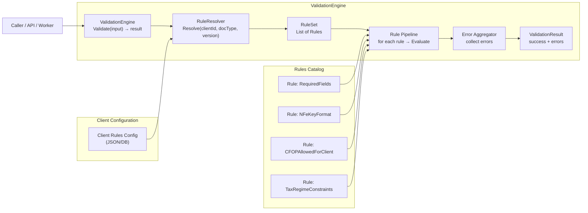

```mermaid
flowchart LR
  A["Caller / API / Worker"] --> B["ValidationEngine<br/>Validate(input) → result"]

  subgraph B1["ValidationEngine"]
    B --> C["RuleResolver<br/>Resolve(clientId, docType, version)"]
    C --> D["RuleSet<br/>List of Rules"]
    D --> E["Rule Pipeline<br/>for each rule → Evaluate"]
    E --> F["Error Aggregator<br/>collect errors"]
    F --> G["ValidationResult<br/>success + errors"]
  end

  subgraph R["Rules Catalog"]
    R1["Rule: RequiredFields"] --> E
    R2["Rule: NFeKeyFormat"] --> E
    R3["Rule: CFOPAllowedForClient"] --> E
    R4["Rule: TaxRegimeConstraints"] --> E
  end

  subgraph CFG["Client Configuration"]
    K["Client Rules Config<br/>(JSON/DB)"] --> C
  end
```
